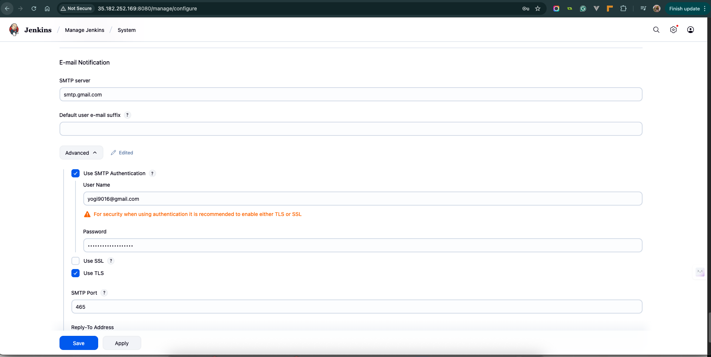

# 🚀 Jenkins CI/CD Pipeline for Flask Application

## 🎯 Objective
Set up a **Jenkins CI/CD pipeline** that automates the testing, building, and deployment of a simple **Flask (Python)** web application on a remote server.

---

## 🧩 Prerequisites

Before starting, ensure you have:
- A **remote Ubuntu server** (with `sudo` privileges)
- **GitHub repository** containing your Flask app and `Jenkinsfile`
- **Docker** installed on your remote host
- A **Jenkins server** set up and running (can be the same or different machine)
- A **Gmail App Password** (for email notifications)

---

## ⚙️ Step 1: Jenkins Installation on Ubuntu Server

Follow these steps to install Jenkins:

### 1️⃣ Update and install dependencies
```bash
sudo apt update && sudo apt install -y fontconfig openjdk-11-jre
```
Jenkins requires Java, so this installs **OpenJDK 11**.

---

### 2️⃣ Add the Jenkins repository key and source
```bash
curl -fsSL https://pkg.jenkins.io/debian-stable/jenkins.io-2023.key | sudo tee   /usr/share/keyrings/jenkins-keyring.asc > /dev/null

echo deb [signed-by=/usr/share/keyrings/jenkins-keyring.asc]   https://pkg.jenkins.io/debian-stable binary/ | sudo tee   /etc/apt/sources.list.d/jenkins.list > /dev/null
```
This step adds the **official Jenkins package repository**.

---

### 3️⃣ Install Jenkins
```bash
sudo apt update
sudo apt install -y jenkins
```

---

### 4️⃣ Enable and start Jenkins
```bash
sudo systemctl enable jenkins
sudo systemctl start jenkins
sudo systemctl status jenkins
```

If Jenkins fails to start, check logs:
```bash
sudo journalctl -xeu jenkins.service
```

---

### 5️⃣ Access Jenkins Web UI
Open Jenkins in your browser:
```
http://<your-server-ip>:8080
```

Get the initial admin password:
```bash
sudo cat /var/lib/jenkins/secrets/initialAdminPassword
```
Paste it in the browser to unlock Jenkins.

---

### 6️⃣ Install Suggested Plugins
After login, select **“Install suggested plugins”** to install common Jenkins plugins.


---

## ⚙️ Step 2: Jenkins Configuration

### 🔑 Configure Global Security
- Go to **Manage Jenkins → Configure Global Security**
- Enable **Allow agents to connect via SSH**
- Create **admin credentials**


---

### 💡 Jenkins Setup Completed
Once basic setup is done, you’ll see the Jenkins dashboard.


---

## 🧰 Step 3: Configure SSH Credentials

- Navigate to **Manage Jenkins → Credentials → Global → Add Credentials**
- Choose **SSH Username with Private Key**
- Add:
  - **ID:** `remote-server`
  - **Username:** `<username>`
  - **Private Key:** (paste from `<key-file>.pem`)
  


---

## ✉️ Step 4: Configure E-mail Notifications (Using Gmail)

1. Enable **2-Step Verification** in your Gmail account.
2. Go to [Google App Passwords](https://myaccount.google.com/apppasswords) → Generate an **App Password**.
3. In Jenkins:
   - Go to **Manage Jenkins → Configure System → Extended E-mail Notification**
   - Set:
     ```
     SMTP server: smtp.gmail.com
     Use SMTP Authentication: Yes
     Username: your-email@gmail.com
     Password: <App Password>
     SMTP Port: 465
     Use SSL: Yes
     ```
4. Test email configuration.



---

## 🧱 Step 5: Create a New Jenkins Job

1. Click **New Item → Pipeline**
2. Enter a name, e.g., `CICD-Pipeline`
3. Choose **Pipeline**
4. Under **Build Triggers**, select:
   - ✅ *GitHub hook trigger for GITScm polling*


---

## ⚡ Step 6: Enable GitHub Hook Trigger

Enable the **GitHub hook trigger** so that Jenkins runs automatically whenever code is pushed.


---

## 🧩 Step 7: Pipeline Configuration Using SCM

- Under **Pipeline → Definition**, select **Pipeline script from SCM**
- Choose:
  - SCM: Git
  - Repository URL: your repo (e.g., `https://github.com/yogi9016/vlearn-cicd-pipeline-using-jenkins.git`)
  - Branch: `main`
  - Script Path: `Jenkinsfile`


---

## 🔗 Step 8: Configure Jenkins Webhook in GitHub Repo

1. Go to your GitHub repo → **Settings → Webhooks**
2. Add a new webhook:
   - **Payload URL:** `http://<jenkins-server-ip>:8080/github-webhook/`
   - **Content type:** `application/json`
   - **Trigger:** “Just the push event”
3. Save webhook.


---

## ✅ Step 9: Verify GitHub Webhook Trigger

Once configured, pushing code to your repository should automatically trigger the Jenkins pipeline.


---

## 🧪 Step 10: Jenkins Pipeline Execution

When triggered, the pipeline will:
1. Checkout the source code
2. Install dependencies
3. Build Docker image
4. Deploy the container
5. Run health checks
6. Send email notifications


---

## 📧 Step 11: Email Notifications

Upon successful or failed build, Jenkins sends an email notification to configured recipients.


---

## 🏁 Final Outcome

- Automated end-to-end CI/CD setup for your Flask app.
- GitHub → Jenkins → Remote Docker Deployment → Email Notification.

---

## 🧰 Tools & Technologies Used

| Tool | Purpose |
|------|----------|
| **Jenkins** | CI/CD automation |
| **GitHub** | Source code hosting |
| **Docker** | Application containerization |
| **NGINX** | Reverse proxy for Flask app |
| **Gmail SMTP** | Build notification emails |
| **Ubuntu** | Deployment environment |

---

💡 *Author: [Yogeswaaran Selvam](https://github.com/yogi9016)*  
📧 *Contact: yogi9016@gmail.com*
